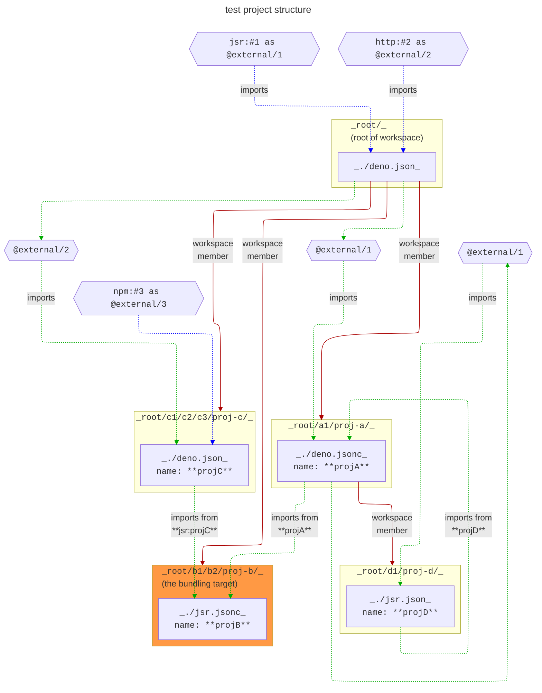

## test 2

in this test, we validate the plugin's support for workspace package import and export resolution.

workspace packages work in the following way:

- ### rules:
  - every package can import its own _exports_ (i.e. self-reference).
  - every package has its child-package's _exports_ available to it as an export.
  - every package has its parent-package's _imports_ available to it as an import.

- ### implications:
  the following rules can be implied from the three rules above:
  - a package can import its from its sibling package's _exports_ (indirectly through the parent package).
  - the root package's imports are available to all child, grandchild, and descendant packages.

- ### example:
  - assume that `W` is the root package, and that it consists of two child packages `X` and `Y`.
  - and then assume that `Z` is a child package of `Y`.
    ```mermaid
    ---
    config:
      layout: elk
    ---

    flowchart TB
    	W --> X & Y
    	Y --> Z
    ```
  - this would result in the following relations:
    - $W_{exports} = X_{exports} \cup Y_{exports} \equiv X_{exports} \cup Y_{exports} \cup Z_{exports}$
    - $W_{imports} = W_{exports} \cup W_{external\_imports} \equiv X_{exports} \cup Y_{exports} \cup Z_{exports} \cup W_{external\_imports}$
    - $X_{exports} = X_{own\_exports} \cup Z_{exports}$
    - $X_{imports} = X_{external\_imports} \cup X_{exports} \cup W_{imports}$
    - $Y_{exports} = Y_{own\_exports}$
    - etc...

## the test


